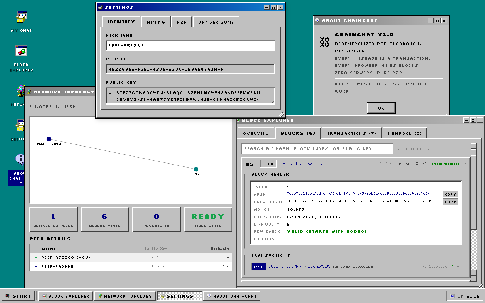
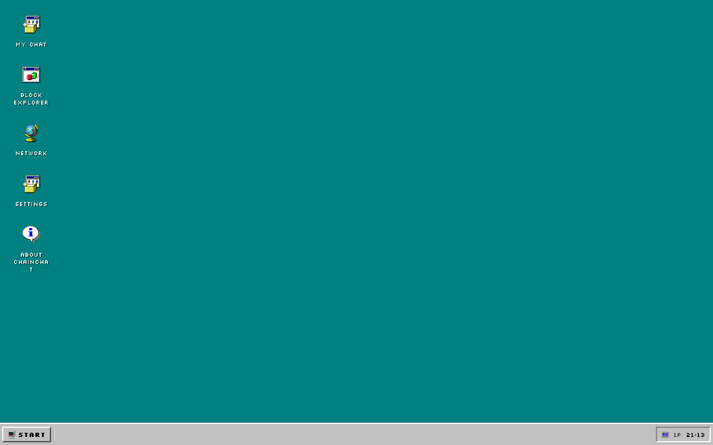
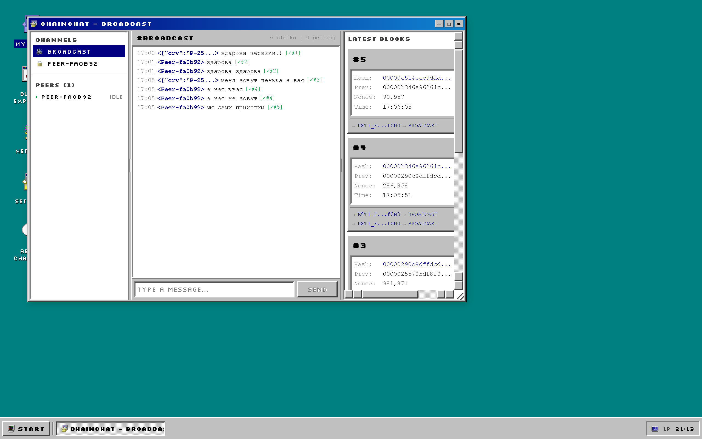
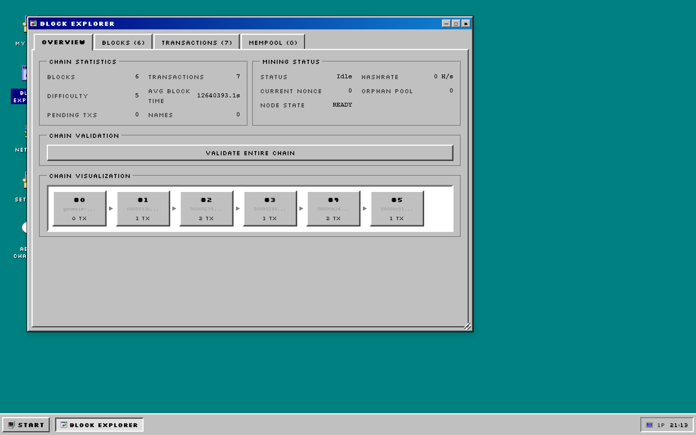

# ChainChat

[](https://github.com/oglenyaboss/chainchat/actions/workflows/ci.yml)
[](LICENSE)

**[Live Demo](https://chainchat-two.vercel.app/)**

A peer-to-peer blockchain messenger with a Windows 95 desktop interface.



<details>
<summary>More screenshots</summary>





</details>

Every message is a cryptographically signed transaction, mined into blocks via Proof of Work, and delivered over a WebRTC mesh network. No servers store your messages — peers relay them directly.

## Why

I had a Nuxt.js course at university. I'd been writing Next.js for about two years at that point, so the standard curriculum didn't feel like a challenge. Instead of doing the bare minimum, I decided to push the limits of what you can build entirely in the browser — no backend database, no message queue, no centralized anything.

The result is a full blockchain implementation running client-side: Proof of Work mining in a Web Worker, WebRTC mesh networking between peers, ECDSA/ECDH cryptography via the native Web Crypto API, and a complete Windows 95 desktop environment as the UI. The only server is a tiny WebSocket relay (~50 lines) that helps peers find each other — after that, everything is direct.

This is a sibling project to [llmshowcase](https://github.com/oglenyaboss/llmshowcase), where I explored running LLM inference directly in the browser. Same idea — take something that "should" need a server and prove it doesn't.

## Features

- **Blockchain** — PoW mining with dynamic difficulty adjustment, fork resolution, orphan pool, transaction deduplication
- **P2P Networking** — WebRTC data channels for direct peer communication, WebSocket signaling server for peer discovery
- **Cryptography** — ECDSA keypair identity, ECDH key exchange, AES-GCM encrypted DMs, message signing and verification, on-chain name registry
- **Win95 Desktop** — draggable/resizable windows, taskbar, start menu, desktop icons
- **Apps** — Chat, Block Explorer, Network monitor, Settings, About

## Architecture

```
┌─────────────────────────────────────────┐
│           Win95 UI Components           │
│  (18 components: windows, taskbar, etc) │
├─────────┬──────────┬─────────┬──────────┤
│  Chat   │ Explorer │ Network │ Settings │
├─────────┴──────────┴─────────┴──────────┤
│             Composables                 │
│   useNodeStateMachine (orchestrator)    │
│   useWebRTC · useSignaling · useMining  │
├─────────────────────────────────────────┤
│             Pinia Stores                │
│   blockchain · chat · identity · peers  │
├─────────────────────────────────────────┤
│              Core lib/                  │
│   blockchain · crypto · sync · protocol │
│   fork-resolution · orphan-pool         │
│   deduplication · name-registry         │
└─────────────────────────────────────────┘
```

## Tech Stack

- **Nuxt 4** + **Vue 3** + **TypeScript**
- **Pinia** with persisted state
- **Tailwind CSS 4**
- **Web Workers** for off-thread mining
- **WebRTC** for P2P mesh
- **Web Crypto API** for all cryptography (no external crypto deps)
- **WebSocket** signaling server

## Getting Started

```bash
# Install dependencies
npm install

# Copy environment config
cp .env.example .env

# Start signaling server + dev server
npm run dev:all
```

The app runs at `http://localhost:3000`, signaling server at `ws://localhost:3001`.

Open in two browser tabs to see P2P messaging in action.

### Requirements

- Node.js 22+
- Modern browser with WebRTC support (Chrome, Firefox, Edge, Safari 15+)

### Troubleshooting

> **Can't connect to peers / "solo mode"?** Stale identity data in localStorage can prevent WebRTC handshakes from completing. Fix: open **Settings > Danger Zone > Reset Identity**, then reload the page.

## Scripts

| Command | Description |
|---------|-------------|
| `npm run dev` | Nuxt dev server |
| `npm run dev:signal` | Signaling server only |
| `npm run dev:all` | Both servers in parallel |
| `npm run build` | Production build |
| `npm test` | Run tests |
| `npm run lint` | Lint code |

## Project Structure

```
app/
  components/
    win95/       # Windows 95 UI component library
    chat/        # Chat UI (messages, channels, peers)
    explorer/    # Block explorer (blocks, transactions, mempool)
    network/     # Network visualization (mesh graph, mining status)
    apps/        # App content panels (chat, explorer, network, settings, about)
  composables/   # WebRTC, signaling, mining, crypto, node state machine
  stores/        # Pinia stores (blockchain, chat, identity, peers, windows)
  lib/           # Core logic (blockchain, protocol, sync, crypto, fork resolution)
  workers/       # Mining web worker
server.js        # WebSocket signaling server
```

## Deployment

The signaling server deploys separately from the Nuxt frontend:

- **Frontend** — any static host or Nuxt-compatible platform
- **Signaling server** — Railway (uses `Dockerfile` and `server.js`)

Set `NUXT_PUBLIC_SIGNALING_URL` to point the frontend at the deployed signaling server.

## Contributing

See [CONTRIBUTING.md](CONTRIBUTING.md) for setup instructions and guidelines.

## License

[MIT](LICENSE)
